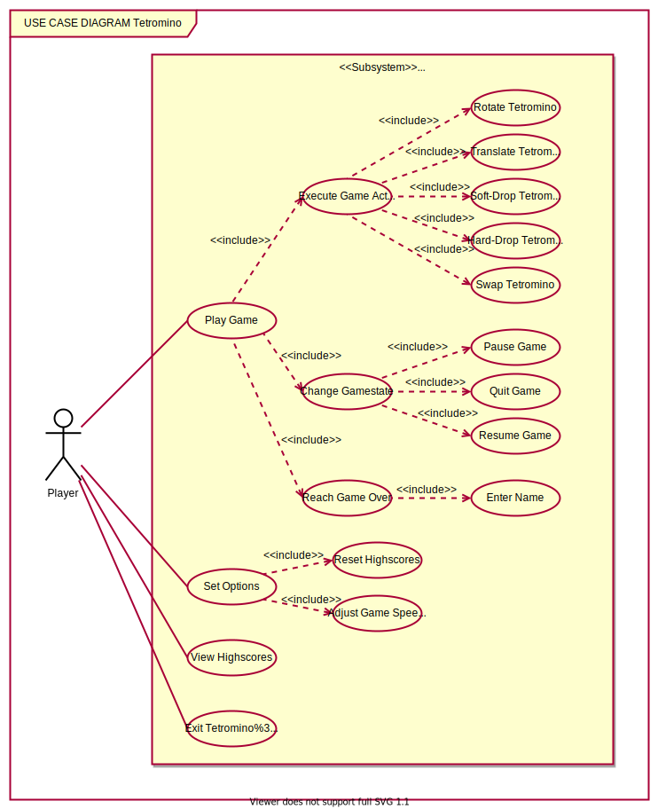
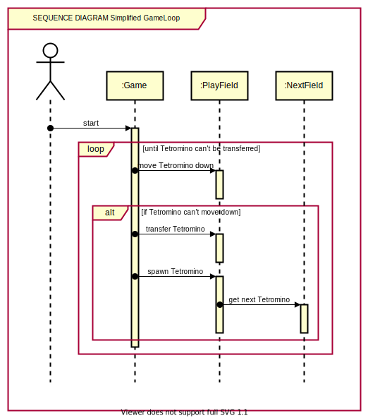

# Tetromino

Tetromino is a Tetris-like game written in Java with JavaFX made by [Jonas](https://github.com/john-luck-pickerd) and myself during our 2nd semester @ HdM Stuttgart.

This is a reupload of the original game which we uploaded to our university's GitLab.

## Excerpt from the original README in German

1. **Kurzbeschreibung**  
Tetromino ist ein - wie der Name impliziert - tetrisähnliches Spiel und damit schnell erklärt:  
Das Spiel generiert zufällige Steine, sogenannte Tetrominos, welche aus vier unterschiedlich angeordneten quadratischen Blöcken bestehen, in einem 10x20-Blöcke großen Spielfeld, die der Spieler dann rotieren und nach links oder rechts bewegen kann, während sich das Tetromino stetig nach unten bewegt. Wenn ein Tetromino auf einem anderen Tetromino oder der unteren Grenze des Spielfelds aufkommt, hört es auf sich zu bewegen und das nächste Tetromino "spawnt". Ziel ist es, Reihen mit Tetrominos zu füllen, wobei gefüllte Reihen verschwinden und darüberliegende Reihen "herunterfallen". Die Punktezahl richtet sich hierbei nach der Anzahl auf einmal gefüllter Reihen. Außerdem gibt es Punkte, wenn man das Tetromino mittels eines Hard- oder Softdrops fallen lässt. Die Punktzahl richtet sich hierbei nach der Anzahl gefallener Reihen. Ein Harddrop lässt das Tetromino sofort nach unten fallen, bis es unten aufkommt. Bei einem Softdrop bewegt sich das Tetromino schneller nach unten. Am Ende eines Spiels kann man sich, indem man einen Namen einträgt, in die Highscoreliste eintragen.

2. **Startklasse**  
Die Main-Methode befindet sich in der Klasse `Launcher`.

3. **Besonderheiten**  
    * **Key Input:** JavaFX bietet als Key Inputs `KEY_PRESSED` und `KEY_RELEASED` an. Diese haben uns als Game Input nicht ausgereicht, weil `KEY_PRESSED` erst den anfänglichen Tastendruck, aber auch wie bei Betriebssystemen üblich einen darauf folgenden wiederholten Input registriert, während die Taste gedrückt gehalten wird. JavaFX hat kein Event für einen einmaligen Tastendruck. Außerdem wollten wir die Periode eines ausgelösten Events durch einen fortwährenden Tastendruck anpassbar machen. Deswegen haben wir auf Basis dieser Events ein komplexeres Inputsystem mit mehr Konfigurationsmöglichkeiten erstellt. So haben wir nun mehrere unterschiedliche Events, welche durch Methoden wie `addPressedEvent`, `addReleasedEvent`, `addPressedAndReleasedEvent`, `addRepeatedEvent` an eine Taste gebunden werden. Beim Repeated Event wird ein `ScheduledExecutorService`-Thread eingesetzt.

    * **Functional Interface:** Zudem haben wir in der `Shape`-Klasse im `tetromino`-Package ein `Functional Interface` `EnumMapProducer` verwendet.

4. **Lessons Learned**  
    * **Javadocs:**  
    Wir haben für einige Klassen bzw. Enums (siehe z.B. `Shape`) Javadocs geschrieben. Unsere Erkenntnis hierbei war, dass Javadocs zwar vor allem bei größeren Klassen bzw. Enums eine große Hilfe beim Verständnis (vor allem von Code, den man nicht selbst geschrieben hat) darstellen können, bei einem Projekt dieses Umfangs in der Regel aber nicht wirklich vonnöten sind. Oft bestehen sie schlichtweg aus redundantem Text (Beschreibung der Funktion entspricht z.B. oft Parameter- bzw. Returnvalues) und bedeuten unnötigen Arbeitsaufwand, den man vielleicht lieber in Verbesserungen der Anwendung investieren sollte.

    * **FXML vs. UI in Code:**  
    Eine Designentscheidung, die wir am Ende der Entwicklungsphase bereut haben war, das Interface des kompletten Spiels, inklusive der Menüs, in Code zu schreiben. Vor allem für statische Scenes, wie die Menüs, wäre es wahrscheinlich besser gewesen, FXML zu verwenden. So entstand oft duplizierter oder ähnlicher und relativ unübersichtlicher Code, durch den die UI erstellt wurde. Unter dem Strich würden wir also bei einem neuen Projekt für statische Scenes FXML und für dynamische Scenes wie die `GameScene` eine programmatisch-erstellte UI wählen.

    * **UML-Diagramme für größere Packages:**  
    Für kleine Packages können UML-Diagramme durchaus sinnvoll sein, vor allem aber bei größeren Packages oder auch dem kompletten Programm sind UML-Diagramme unserer Ansicht nach sehr unübersichtlich und nicht wirklich hilfreich.

5. **UML-Diagramme**  
    5.1. **Klassendiagramm**  
      
    Dies ist nur die `Tetromino`-Klasse. Das gesamte Klassendiagramm findet sich unter [Tetromino/uml/complete_class_diagram.png](Tetromino/uml/complete_class_diagram.png).

    5.2. **Anwendungsfalldiagramm**  
      

    5.3. **Sequenzdiagramm**  
    
    

6. **Stellungnahme**  
    * **Architektur:**  
        * **Beispiele verwendeter Interfaces:**
            * `SceneInterface`: Wird implementiert von `StartMenuScene`, `GameScene`, `HighscoreListScene` und `OptionsMenuScene`, welche von der `SceneFactory` mittels des `SceneType`-Enums initialisiert werden. 
            * `GameSpeedManager` und `HighscoreListManager` (welche beide `DataManager` erweitern): Werden respektive implementiert von `GameSpeedUserPreferencesManager` und `HighscoreListUserPreferencesManager` und durch die `DataManagerFactory` erstellt.
    * **Clean Code**  
        * Alle Getter und Setter, die nicht-primitive oder mutable Datentypen übergeben, erzeugen eine Kopie des Objekts, sodass niemals das gleiche Objekt mit identischer Adresse übergeben wird. Methoden, die Instanzen eigener Klassen zurückgeben, verwenden stets eine `copy()`-Funktion, die eine Kopie des Objekts zurückgeben. Siehe so z.B. in `Tetromino.java` oder `Score.java`.
        * Unsere Interfaces und Factories (siehe *Architektur*) führen zu loose coupling. So ist z.B. der Datentyp von `nextScene` beim `LinkButton` ein SceneInterface und nicht schon der konkrete Datentyp der Scene, welche durch die `SceneFactory` erstellt wird.
    * **Tests:**  
        * Unsere Unit Tests liegen im `test`-Ordner. Wir haben hierbei wichtige Methoden der Klassen `Score` und `Tetromino` getestet und auch die Klassen dementsprechend benannt.
        * In `ScoreTest.java` befinden sich außerdem die Negativtests `negativeTestLineIncreaseWithInvalidLineNumber()` und `testInvalidNumberOfClearedLinesException()`, wo eine Methode jeweils mit einem unvorhergesehenen Wert aufgerufen wird. In diesem Fall soll sich z.B. der Wert eines `Score`-Objekts dann nicht ändern, was in `negativeTestLineIncreaseWithInvalidLineNumber()` getestet wird und eine `InvalidNumberOfClearedLines` Exception geworfen werden, was durch `testInvalidNumberOfClearedLinesException()` überprüft wird.
    * **GUI (JavaFX):**  
        * Unsere UI besteht aus mehreren Szenen, welche untereinander navigierbar sind.
        * Unsere GUI, sowohl die Menüs, als auch die `GameScene`, haben wir in Java-Code erstellt (siehe auch *4. Lessons Learned - FXML vs. UI in Code*), hiermit in Verbindung stehende Dateien finden sich im `gui`-Ordner. Trotzdem haben wir das Styling größtenteils mithilfe von CSS-Stylesheets vorgenommen, welche sich im `resources`-Ordner `stylesheets` befinden. 
    * **Logging/Exceptions:**  
        * Als logging utility verwenden wir `log4j2`. Die Konfigurationsdatei `log4j2.xml` findet sich im `resources`-Ordner. Geloggt wird sowohl in der Konsole, als auch in der Datei `A1.log`.
        * Wenn Probleme auftreten, die das Programm aber auffangen kann (wie z.B. falls die Schriftart in `Application.json` nicht geladen werden kann, indem eine Ersatzschriftart verwendet wird), so loggen wir dies mit dem "Warn"-Level. In diesem Zusammenhang verwenden wir auch unsere eigenen Exceptions `InvalidNumberOfClearedLinesException` und `UnassignedKeyException`.
    * **UML:**  
        * Alle unsere UML-Diagramme befinden sich im [Tetromino/uml](Tetromino/uml)-Ordner.
        * Darin finden sich ein Klassendiagramm des `tetromino`-Packages, ein Anwendungsfalldiagramm unserer kompletten Anwendung, sowie ein Sequenzdiagramm einer vereinfachten Gameloop. Zudem befindet sich dort auch ein Klassendiagramm unserer kompletten Anwendung.
    * **Threads:**  
        * Wir verwenden Threads an zwei Stellen:
            * `KeyInput`: Siehe *3. Besonderheiten*.
            * `Game`: Hier wird ein `ScheduledExecutorService` als game loop verwendet, deren Periode die Fallgeschwindigkeit des Tetrominos angibt. In ihr wird ein Teil der Gamelogik abgehandelt.
        * Alle `ScheduledExecutorService`-Threads werden hierbei als Daemon erstellt, sodass sie sich beim Schließen der Anwendung selbst beendet.
        * Beim Ende von Thread-Tasks werden die Threads nicht geschlossen, sondern nur die Tasks beendet. So kann man bei erneuter Verwendung denselben Thread mit einem neuen Task verwenden.
    * **Streams und Lambda-Funktionen:**  
        * Wir setzen Streams und Lambda-Funktionen z.B. in `HighscoreList` ein, wo die `getHighscores()`-Methode Kopien aller `Score`-Objekte erzeugt und diese gesammelt als `List<Score>` zurückgibt.
        * Zudem verwenden wir im Enum `Shape` ein Functional Interface `EnumMapProducer`, welches durch eine Lambda-Funktion instantiiert werden kann.
        * In der `addScore()`-Methode in der `HighscoreList`-Klasse wird ein Parallel-Stream verwendet. Dieser wird beim Hinzufügen eines Scores eingesetzt. Bei diesem wird zuerst die Highscorelist gefiltert, sodass nur noch Scores, die kleiner als der hinzuzufügende Score sind, übrig bleiben. Danach wird, falls vorhanden, der höchste Score genommen.
